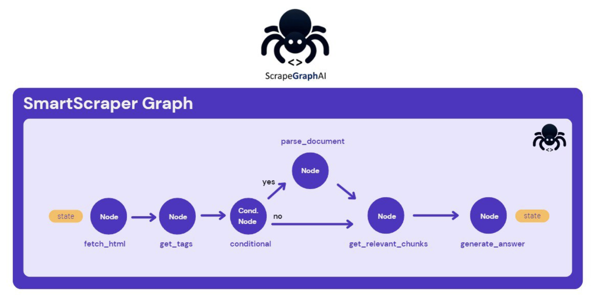

# 🔊 Speech graph
```python
# if you plan on using text_to_speech and GPT4-Vision models be sure to use the
# correct APIKEY
OPENAI_API_KEY = "YOUR_API_KEY"
```

**SpeechSummaryGraph** is a class representing one of the default scraping pipelines that generate a summary of the website and return it together with an audio file. Similar to the **SmartScraperGraph** but with the addition of the **TextToSpeechNode** node.
```python
"""
Basic example of scraping pipeline using SpeechSummaryGraph
"""

from scrapegraphai.graphs import SpeechSummaryGraph

llm_config = {
    "api_key": OPENAI_API_KEY
}

# Save the audio to a file
audio_file = "website_summary.mp3"
speech_summary_graph = SpeechSummaryGraph("Make a summary of the webpage to be converted to audio for blind people.",
                             "https://perinim.github.io/projects/", llm_config,
                                audio_file)

final_state = speech_summary_graph.run()
print(final_state.get("answer", "No answer found."))
```
```bash
Fetching pages: 100%|##########| 1/1 [00:00<00:00, 13.14it/s]
---GET PROBABLE TAGS---
Possible tags:  h1 h2 h3 p ul li div
---GENERATE ANSWER---
---TRANSLATING TEXT TO SPEECH---
Audio saved to website_summary.mp3
{'summary': "This webpage is about Marco Perini's projects. It includes projects like Rotary Pendulum RL, DQN Implementation from scratch, Multi Agents HAED, and Wireless ESC for Modular Drones. The page also contains information about the author, links to other sections like About and CV, and a footer with copyright information. The webpage is designed with a fixed top navigation bar and a progress bar. It is powered by Jekyll with the al-folio theme and hosted on GitHub Pages."}
```