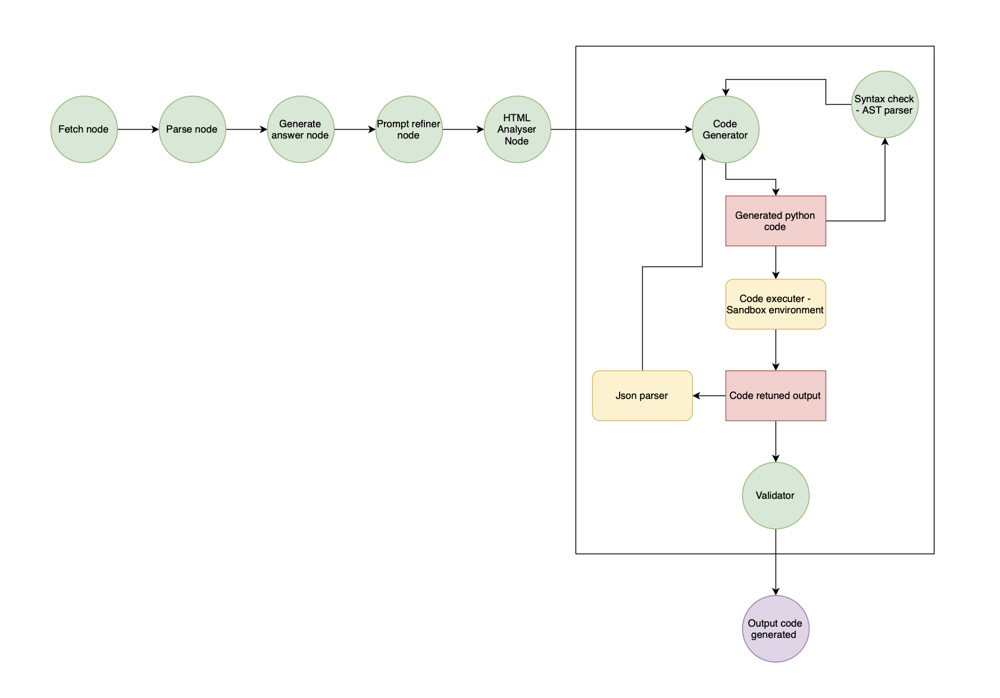

# 🫀 CodeGeneratorGraph

**CodeGeneratorGraph** is responsible for generating Python code that extracts specific data from HTML pages using the BeautifulSoup library. It creates a workflow that consists of interconnected nodes handling different stages of the scraping process, from fetching HTML content to generating Python functions based on user prompts.

### Attributes

- `prompt (str)`: The user-defined prompt for guiding the code generation process.
- `source (str)`: The URL or local directory from which the HTML content is sourced.
- `config (dict)`: Configuration options for the graph, such as model settings and execution flags.
- `schema (BaseModel)`: Defines the expected output structure for the generated code.
- `llm_model`: An instance of a language model used for generating answers based on the provided prompt.
- `embedder_model`: An embedding model for processing text data into vector embeddings.
- `verbose (bool)`: Flag indicating whether to display detailed execution logs.
- `headless (bool)`: Specifies whether to run the scraping process in headless mode.
- `reduction (int)`: Defines the level of reduction to apply to the HTML content (can be 0, 1, or 2).
- `max_iterations (dict)`: Maximum number of iterations for each reasoning loop of `GenerateCodeNode`.

### Methods

#### `__init__(self, prompt: str, source: str, config: dict, schema: Optional[BaseModel] = None)`
Initializes the CodeGeneratorGraph with a user-defined prompt, data source, configuration, and schema.

**Args:**
- `prompt (str)`: The prompt guiding the graph's workflow.
- `source (str)`: The data source (URL or local directory) to scrape from.
- `config (dict)`: Configuration parameters, including model settings.
- `schema (Optional[BaseModel])`: Output schema for validating the generated code.

#### `_create_graph(self) -> BaseGraph`
Creates and connects the nodes for the web scraping process, constructing a graph that defines the workflow from fetching data to generating Python code.

**Returns:**
- `BaseGraph`: The constructed graph containing the workflow nodes.

#### `run(self) -> str`
Executes the graph and returns the generated Python code for data extraction.

**Returns:**
- `str`: The generated code or an error message if no code was created.

### Example Usage

```python
code_gen = CodeGeneratorGraph(
    prompt="List me all the attractions in Chioggia.",
    source="https://en.wikipedia.org/wiki/Chioggia",
    config={"llm": {"model": "openai/gpt-3.5-turbo"}}
)

result = code_gen.run()
print(result)
```

## Flow of the process


***