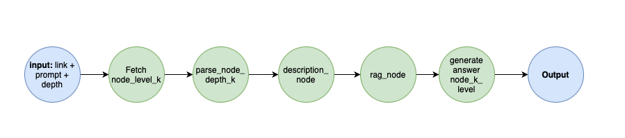

# 🐸 DepthSearchGraph Module
## Overview

`DepthSearchGraph` is a script generator pipeline that generates the function `extract_data(html: str) -> dict()` for extracting the wanted information from a HTML page. The code generated is in Python and uses the library BeautifulSoup. It requires a user prompt, a source URL, and an output schema.

## Attributes

- `prompt` (str): The prompt for the graph.
- `source` (str): The source of the graph.
- `config` (dict): Configuration parameters for the graph.
- `schema` (BaseModel): The schema for the graph output.
- `llm_model`: An instance of a language model client, configured for generating answers.
- `embedder_model`: An instance of an embedding model client, configured for generating embeddings.
- `verbose` (bool): A flag indicating whether to show print statements during execution.
- `headless` (bool): A flag indicating whether to run the graph in headless mode.
- `library` (str): The library used for web scraping (beautiful soup).

## Args

- `prompt` (str): The prompt for the graph.
- `source` (str): The source of the graph.
- `config` (dict): Configuration parameters for the graph.
- `schema` (BaseModel): The schema for the graph output.

## Flow of the process

